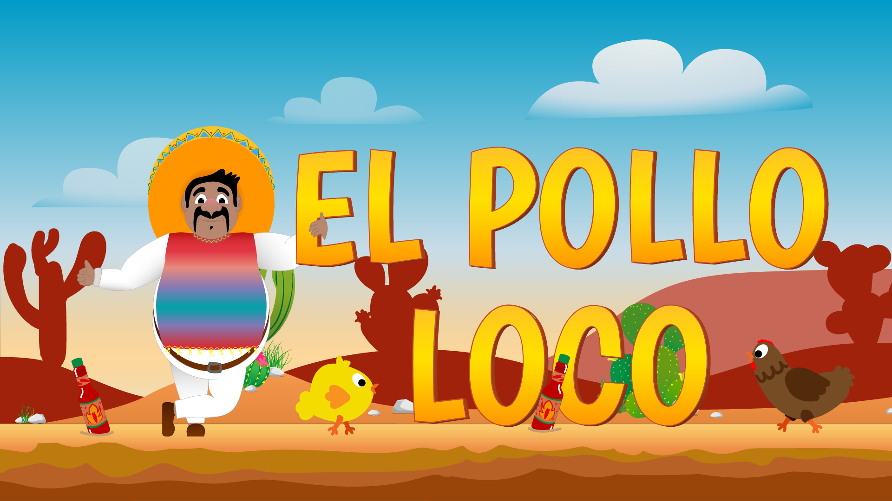

🐔 El Pollo Loco

  
 
 <strong>A high-performance 2D browser game built with pure JavaScript and HTML5 Canvas</strong> 
 
 <a href="#">🎮 Play Live</a> • <a href="#features">✨ Features</a> • <a href="#architecture">🧱 Architecture</a> • <a href="#getting-started">🚀 Setup</a> 

🎮 Game Overview

El Pollo Loco is a side-scrolling action game where players fight enemies, collect resources, and defeat a final boss.

The project was built from scratch using vanilla JavaScript, focusing on performance, clean architecture, and real-time game mechanics — without any external libraries or frameworks.

✨ Features
🎯 Gameplay Mechanics
Smooth character movement and jump physics
Enemy interactions with collision detection
Throwable objects (bottles)
Boss fight with health system
Collectibles (coins & bottles)
🧠 Game Systems
Finite State Machine (start, running, win, lose)
Real-time collision engine
Restart & full reset logic
Object lifecycle management
🎨 User Interface
Dynamic UI overlay system
Animated start, win, and game-over screens
Interactive buttons with transitions
Modal dialog system (with blur + animation)
Responsive layout structure
🔊 Audio System
Background music loop
Sound effects (hit, collect, boss, win/lose)
Mute toggle with dynamic icon switching
🖥️ Additional Features
Fullscreen mode
Asset preloading (ImageManager)
Modular and scalable code structure
🧪 Live Demo

👉 Play the Game

(Insert your GitHub Pages link here)

🎯 Controls
Key	Action
⬅️ ➡️	Move left/right
⬆️ / SPACE	Jump
D	Throw bottle
📸 Screenshots
🟡 Start Screen

🔴 Game Over

🟢 Victory

🧱 Architecture

The game follows a modular, object-oriented structure:

World
 ├── Character
 ├── Enemies
 │    ├── Chicken
 │    └── Endboss
 ├── Collectibles
 │    ├── Coins
 │    └── Bottles
 ├── Status Bars
 ├── Sound Manager
 └── Image Manager

Key Concepts
Game Loop using requestAnimationFrame
State Management for UI and gameplay
Entity-based system
Separation of concerns (UI vs Game Logic)
🛠 Tech Stack
Technology	Purpose
HTML5 Canvas	Rendering engine
JavaScript (ES6)	Game logic
CSS3	UI and animations
🚀 Getting Started
1. Clone the repository
git clone https://github.com/your-username/el-pollo-loco.git

2. Run locally

Use a local development server:

# Example (VS Code)
Right-click index.html → Open with Live Server

⚠️ Running via file:// may cause asset loading issues.

⚠️ Important Notes
Audio playback requires user interaction due to browser security policies
All assets must be served via a local server
🧠 What This Project Demonstrates

This project highlights:

Structuring large-scale JavaScript applications
Real-time rendering and animation handling
Building interactive UI systems
Managing complex game states
Debugging performance-critical logic
🔮 Future Improvements
📱 Mobile / touch controls
🧠 Advanced enemy AI
🌍 Multiple levels
💾 Save & load system
🏆 Leaderboard
📜 Privacy Policy
No personal data collected
No cookies
No tracking

This game runs entirely in your browser.

👨‍💻 Author

Developed as a portfolio project focused on clean architecture and gameplay systems.

⭐ Support

If you like this project:

⭐ Star the repository
🍴 Fork it
🛠 Contribute improvements
