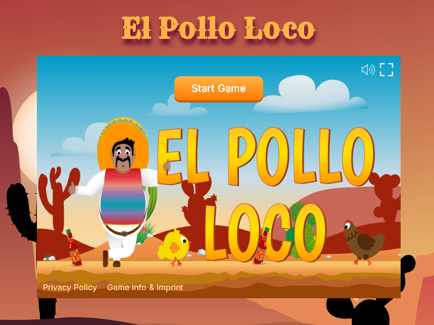

<strong> El Pollo Loco </strong>

  
 
 <strong>A 2D browser game built with Object-Oriented JavaScript and the HTML5 Canvas API</strong> 
 
 <a href="#"> Play Live</a> • <a href="#features"> Features</a> • <a href="#architecture"> Architecture</a> • <a href="#getting-started"> Setup</a> 
    

<strong> Game Overview : </strong>
  
El Pollo Loco is a fast-paced 2D side-scrolling action game where players fight enemies, collect resources, and defeat a final boss.
The game was built from scratch using vanilla JavaScript, with a strong focus on:   

- Clean object-oriented architecture
- Real-time rendering & animation
- High performance and responsiveness

No frameworks. No libraries. Just pure JavaScript.    

<strong> Features      </strong>
<strong> Gameplay :  </strong>
- Smooth character movement and jump physics
- Enemy interactions with collision detection
- Throwable weapons (bottles)
- Boss fight with health system
- Collectibles (coins & bottles)

<strong> Game Systems : </strong>
- Finite State Machine (start, running, win, lose)
- Real-time collision engine
- Full restart & reset logic
- Object lifecycle management

<strong> User Interface : </strong>
- Dynamic UI overlay system
- Animated start, win, and game-over screens
- Interactive buttons with smooth transitions
- Modal dialog system (blur + animation)
- Responsive layout

<strong> Audio : </strong>
- Background music loop
- Sound effects (hit, collect, boss, win/lose)
- Mute toggle with dynamic icon

<strong> Additional : </strong>
- Fullscreen mode
- Asset preloading system (ImageManager)
- Modular and scalable code structure

<strong> Live Demo   </strong>
Play the Game 
(https://github.com/Ali-Alizada)

<strong> Controls :     </strong>
⬅️ ➡️ Move left / right  
⬆️ / SPACE Jump  
D   Throw bottle  

<strong> Architecture   </strong>
The game follows a modular, object-oriented design :    
World
 ├── Character
 ├── Enemies
 │    ├── Chicken
 │    └── Endboss
 ├── Collectibles
 │    ├── Coins
 │    └── Bottles
 ├── Status Bars
 ├── Sound Manager
 └── Image Manager    

<strong> Key Concepts : </strong>
- Game loop using requestAnimationFrame
- State management for UI and gameplay
- Entity-based architecture
- Separation of concerns (UI vs Game Logic)

<strong> Tech Stack : </strong>
- HTML5 Canvas → Rendering engine
- JavaScript (ES6) → Game logic (OOP)
- CSS3 → UI & animations

<strong> Getting Started : </strong>
1. Clone the repository
git clone https://github.com/Ali-Alizada/el-pollo-loco.git

2. Run locally
Use a local development server:
Right-click index.html → Open with Live Server

Running via file:// may cause asset loading issues

<strong> Important Notes : </strong>
- Audio playback requires user interaction (browser policy)
- All assets must be served via a local server

<strong> What This Project Demonstrates : </strong>
- Structuring large JavaScript applications
- Real-time rendering and animation systems
- Interactive UI development
- Game state management
- Debugging performance-critical logic  

<strong> Future Improvements : </strong>
- Mobile / touch controls
- Advanced enemy AI
- Multiple levels
- Save & load system
- Leaderboard

<strong> Privacy Policy : </strong>
- No personal data collected
- No cookies
- No tracking
Runs entirely in your browser

<strong> Author 
Developed as a portfolio project with focus on : </strong>
- Clean architecture
- Gameplay systems
- Performance

<strong> Support 
If you like this project : </strong>
- Star the repository
- Fork it
- Contribute improvements

<strong> Why this version is better : </strong>
- No “GitHub bullet clutter”
- Clean spacing like real game docs
- Easy to scan in 5 seconds
- Looks like actual game studio documentation
